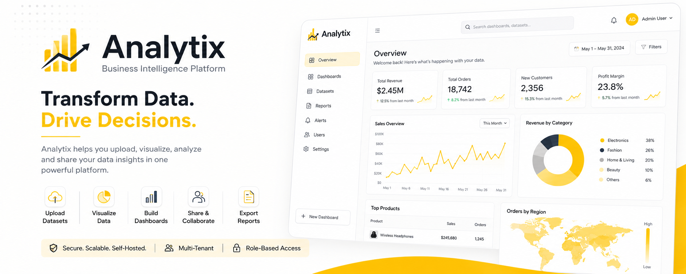

# Analytix

> A Modern Business Intelligence & Analytics Platform Built with Django and React



## Overview

Analytix is a self-hosted Business Intelligence (BI) platform designed to help organizations transform raw data into meaningful insights through interactive dashboards, visual analytics, reporting, and team collaboration.

Inspired by industry-leading platforms such as Microsoft Power BI, Tableau, and Metabase, Analytix provides a modern, scalable, and extensible solution for businesses that need powerful analytics without vendor lock-in.

---

## Vision

Empower businesses to make data-driven decisions through a fast, intuitive, and affordable analytics platform.

Analytix enables users to:

* Upload datasets
* Create visual dashboards
* Monitor KPIs
* Generate reports
* Share insights with teams
* Analyze business performance
* Build custom analytics workflows

---

## Key Features

### Dataset Management

* CSV Upload
* Excel Upload
* Dataset Versioning
* Data Type Detection
* Metadata Generation
* Data Validation

### Dashboard Builder

* Drag & Drop Widgets
* Responsive Layouts
* Real-Time Configuration
* Dashboard Templates
* Dashboard Cloning

### Visualization Library

* KPI Cards
* Bar Charts
* Line Charts
* Pie Charts
* Area Charts
* Data Tables
* Summary Metrics

### Analytics Engine

* Aggregations
* Group By Operations
* Filters
* Metrics Calculation
* Trend Analysis

### Reporting

* PDF Export
* Excel Export
* Dashboard Snapshots
* Scheduled Reports (Future)

### Collaboration

* Team Management
* Organization Workspaces
* Dashboard Sharing
* Public Links
* Permission Control

### Security

* JWT Authentication
* Role-Based Access Control (RBAC)
* Audit Logging
* Rate Limiting
* Secure File Uploads

---

## Tech Stack

### Frontend

* React 19
* TypeScript
* Vite
* Tailwind CSS
* ShadCN UI
* React Query
* Zustand
* React Router
* AG Grid
* Recharts
* React Grid Layout

### Backend

* Django 5
* Django REST Framework
* PostgreSQL
* Celery
* Redis
* Pandas
* OpenPyXL

### Infrastructure

* Docker
* Nginx
* PostgreSQL
* Redis

---

## Project Structure

```bash
analytix/

├── frontend/
│
├── backend/
│
├── docs/
│
├── docker/
│
├── docker-compose.yml
│
├── README.md
│
└── .gitignore
```

---

## Frontend Structure

```bash
frontend/

src/

├── app/
├── pages/
├── features/
├── components/
├── services/
├── hooks/
├── routes/
├── store/
├── types/
├── utils/
├── assets/
└── styles/
```

---

## Backend Structure

```bash
backend/

apps/

├── authentication/
├── organizations/
├── users/
├── datasets/
├── dashboards/
├── widgets/
├── analytics/
├── reports/
├── notifications/
└── audit_logs/

config/
core/
media/
static/
```

---

## User Roles

### Super Admin

* Manage platform
* Manage subscriptions
* Manage organizations
* View system analytics

### Organization Admin

* Manage users
* Manage datasets
* Manage dashboards
* Manage reports

### Analyst

* Upload datasets
* Create dashboards
* Create reports
* Configure widgets

### Viewer

* View dashboards
* View reports
* Export reports

---

## Core Modules

### Authentication

* Login
* Registration
* Password Reset
* Email Verification
* JWT Authentication

### Organizations

* Multi-Tenant Architecture
* Workspace Isolation
* Team Management

### Datasets

* Upload
* Validation
* Metadata Extraction
* Version Control

### Dashboards

* Create
* Edit
* Delete
* Duplicate

### Widgets

* KPI Cards
* Charts
* Tables
* Metrics

### Reports

* PDF Generation
* Excel Generation
* Export Management

### Notifications

* In-App Notifications
* Activity Updates

### Audit Logs

* User Activity Tracking
* Change History

---

## Performance Goals

Analytix is designed to support:

* 100,000+ rows per dataset
* Virtualized tables
* Lazy loading
* Optimized queries
* Background processing
* Scalable architecture

---

## Security Standards

* JWT Authentication
* Refresh Tokens
* Role-Based Access Control
* Input Validation
* File Validation
* CSRF Protection
* XSS Protection
* SQL Injection Prevention
* OWASP Best Practices

---

## Roadmap

### Version 1.0

* Dataset Upload
* Dashboard Builder
* Widget System
* Reporting
* Team Management

### Version 2.0

* Scheduled Reports
* Dashboard Templates
* Advanced Analytics
* Public Dashboard Links

### Version 3.0

* AI-Powered Insights
* Natural Language Queries
* Smart Dashboard Generation
* Predictive Analytics

---

# Default Login Credentials

This document lists the pre-registered accounts and login credentials configured for development and testing in the Analytix BI Platform.

---

## 1. Django Superuser (System Admin)
Use these credentials to access full administrative privileges.
* **Email / Username**: `mustafapinjari344@gmail.com`
* **Password**: `55555`

---

## 2. Pre-registered Test Accounts
These accounts have standard analyst/viewer workspace access.
* **Analyst User 1**:
  - **Email**: `user123@analytix.com`
  - **Password**: `password123`
* **Analyst User 2**:
  - **Email**: `test@analytix.com`
  - **Password**: `password123`

---

## 3. Mock Corporate SSO SAML Login
For fast-pass authentication matching CUST-11 single sign-on redirects:
* Simply click the **"SAML Identity Provider SSO"** button on the Login Screen.
* The system will bypass credential forms and authenticate as:
  - **Email**: `sso@enterprise.com`
  - **Role**: `admin`


## Development Principles

Analytix follows:

* Clean Architecture
* SOLID Principles
* Domain-Driven Design
* Feature-Based Frontend Architecture
* Modular Backend Design
* API-First Development

---

## License

This project is licensed under the MIT License.

---

## Author

**Mustafa Pinjari**

Full Stack Developer | Business Analyst Enthusiast

Building scalable software, analytics platforms, and intelligent business solutions.
